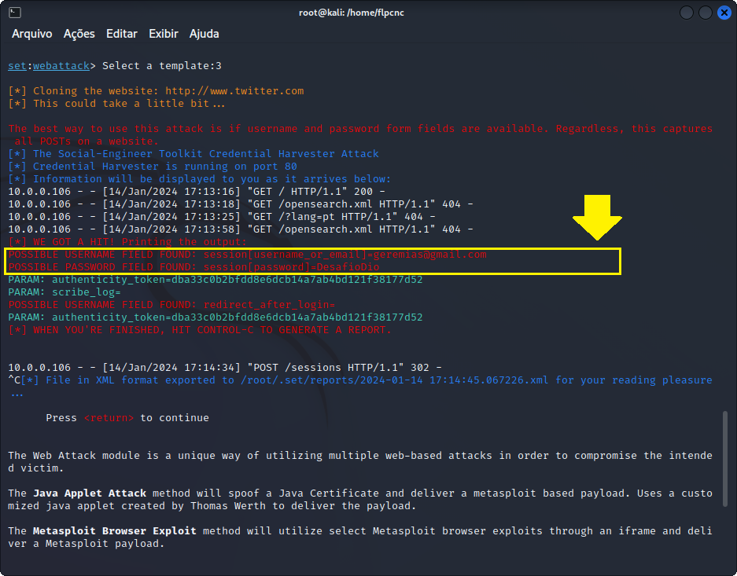

# Desafio DIO CyberSecurity

## Ferramentas:

- Kali Linux
- setoolkit
- Windows 7

## Configurando o Phishing no Kali Linux

1. Acesse como root:
    ```bash
    sudo su
    ```

2. Inicie o setoolkit:
    ```bash
    setoolkit
    ```

3. Escolha o tipo de ataque:
   - **Social-Engineering Attacks**

4. Selecione o vetor de ataque:
   - **Web Site Attack Vectors**

5. Escolha o método de ataque:
   - **Credential Harvester Attack Method**

6. Selecione o método de ataque:
   - **Web Templates**

7. Obtenha o endereço IP da sua máquina:
    ```bash
    ifconfig
    ```

   Anote o endereço IP atribuído à sua interface de rede.

8. Configure a URL para clonar (exemplo):
   - **URL para clonar: http://twitter.com**

## Imagem de Referência:


